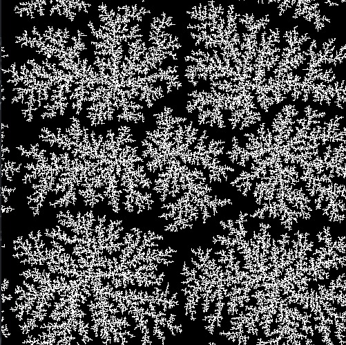

# NFrostN
this is an animated version of NFrostN particle diffusion algorithm

### Language
This is built with Processing version 3.5.3. Go pick up the latest version at
www.processing.org Downloadthe git repo open up either .pde file. It should open
the processing IDE that comes with the language. Processing is just a library and
they have made the library for use with Java, Javascript, Python, and maybe others.
I made this one with the Java library. Please make sure you also download that portion if missing.  

## Overview
What in the world is NFrostN? It makes this bad ass frost like picture! This is
a simple program I made for an intermediate Java class in college. The professor was
Dr. David Ackley. He was by far the best teacher I have EVER experienced. This is a spec that he designed for the class.
The original spec wrote an output picture of type PPM. I suppose the goal was to teach
how to write to a file that itself had a specific spec to follow. In this project I
Rebuilt it as an animation instead. This is what the animation looks like:  

  

This is what the finished animation will look like:  

  

Looks really cool huh! Here is the general information about the
