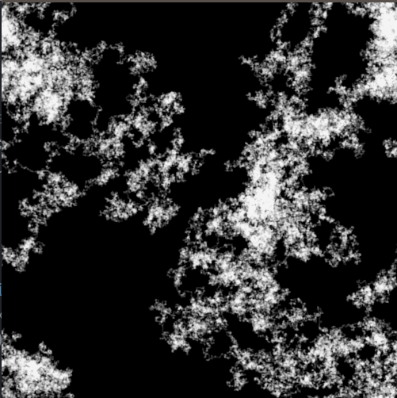

# NFrostN
this is an animated version of NFrostN particle diffusion algorithm

### Language
This is built with Processing version 3.5.3. Go pick up the latest version at
www.processing.org Downloadthe git repo open up either .pde file. It should open
the processing IDE that comes with the language. Processing is just a library and
they have made the library for use with Java, Javascript, Python, and maybe others.
I made this one with the Java library. Please make sure you also download that portion if missing.  

## Overview
What in the world is NFrostN? It makes this bad ass frost like picture! This is
a simple program I made for an intermediate Java class in college. The professor was
Dr. David Ackley. He was by far the best teacher I have EVER experienced. This is a spec that he designed for the class.
The original spec wrote an output picture of type PPM. I suppose the goal was to teach
how to write to a file that itself had a specific spec to follow. In this project I
Rebuilt it as an animation instead. This is what the animation looks like:  

  

This is what the finished animation will look like:  

  

Looks really cool huh! Here is the general information about the program:

- 2D Array to keep track of weather the pixel/cell is on or off.
- particle will diffuse from a random cell that is off
- Particle will perform a random walk either north, south, east, or west.
- it will perform this walk for either 2*(gridWidth * gridHeight) times oruntil it is north, south, east, or west of another particle. If one of these are met the particle will stick and permanently get added to the grid.
- every time a particle  sticks a counter will increment. the counter will be divided by total cells to get percentage of filled cells. if it is above the parameter particleDensity it will stop diffusing new particles.  

That is it! pretty simple huh!! download and have fun playing around with it. one particular thing I noticed was when
drawing every cell one particle travels until it sticks makes for an interesting pattern. I gave the cell some some
transparency to see when a cell is traveled more that once. check it out below:

 It looks like land or a cloud or something really freaking cool huh!!!??? play around with it by uncommenting it  on lines 90 through 96 in NFrostN.pde  

  
